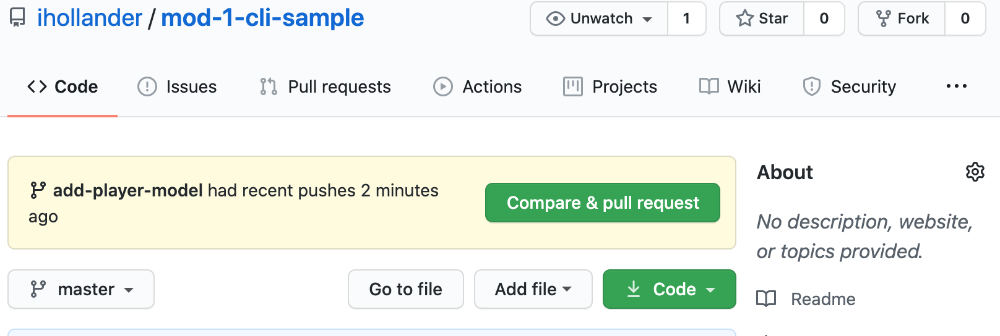
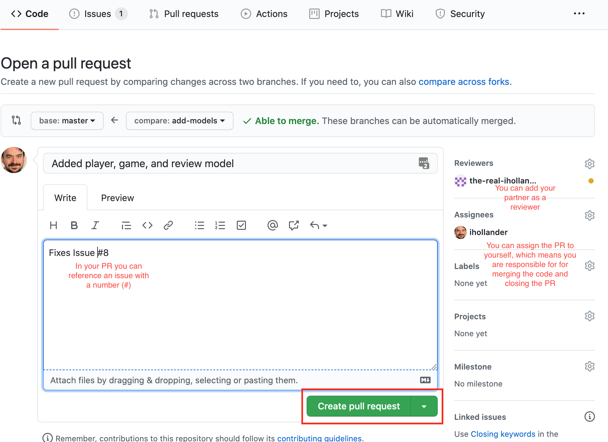
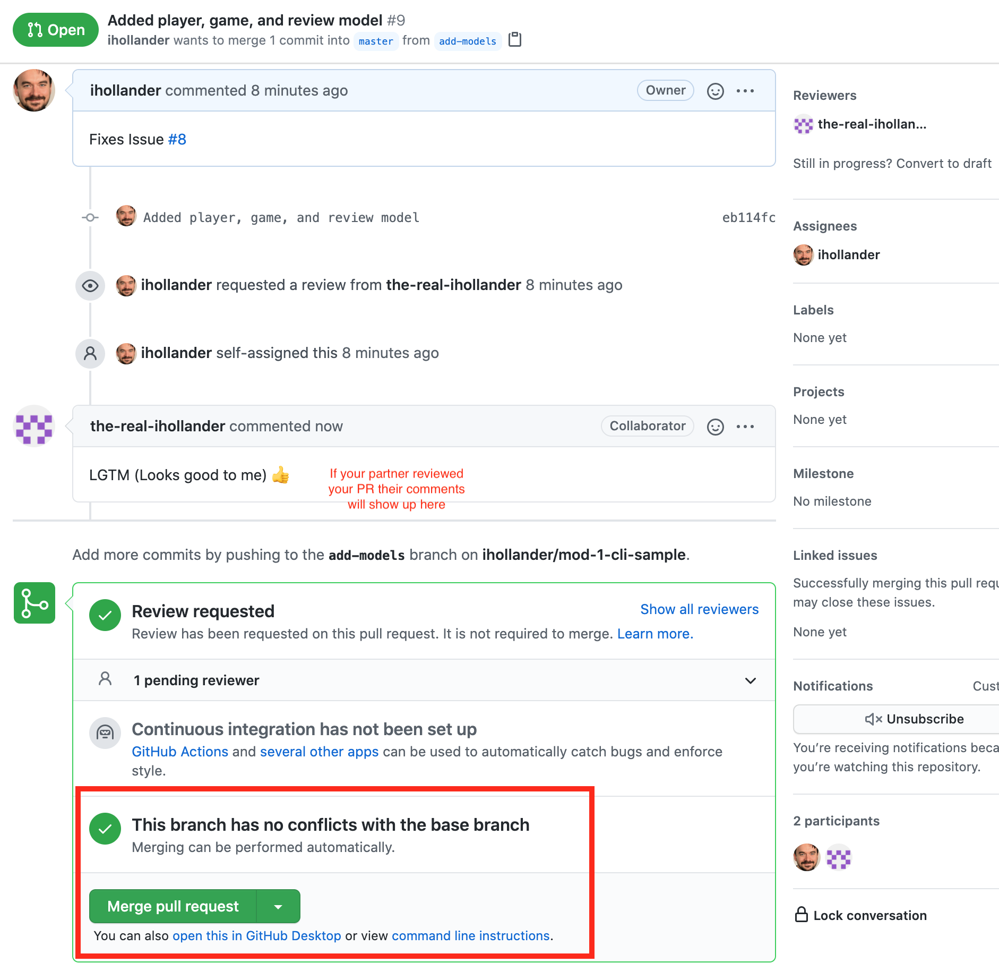

# Common Git Workflows For Collaborating

Here are a few common scenarios you'll find when working on a project using `git` and GitHub, and suggested workflows for each scenario. 

- **Scenario**: You're starting a project from scratch with no pre-existing connection to GitHub.
    - Goto [Project Setup](#project-setup)
- **Scenario**: You're ready to add some new code to your project! You have a plan on the feature you'd like to add, or the bug you're going to try to fix.
    - Goto [Adding New Code](#adding-new-code)
- **Scenario**: Your partner has added a new feature, made a pull request, and merged that feature into the master branch. How do you update your local repository and your local branch to include that code?
    - Goto [Syncing With a Remote](#syncing-with-a-remote)
- **Scenario**: Two people have made changes to the same file, and git can't automatically merge the changes. How do you fix the merge conflicts?
    - Goto [Fixing Merge Conflicts](#fixing-merge-conflicts)


## Project Setup

- [ ] In the root directory of your project, create a new local git repository: 

```
$ git init
```

- [ ] Make a commit:

```
$ git add .
$ git commit -m 'Initial commit'
```

- [ ] Create a new remote repository on GitHub: from [github.com](https://github.com), click the + icon in the top-right corner and follow the steps to create a new repository.

- [ ] (*optional*) If you're working with a partner, add them as a collaborator on GitHub: From your repo, go to Settings > Manage Access > Invite a collaborator and enter your partner's username. Once your partner has access, they should `git clone` (**don't fork**) your repository.

- [ ] Connect the remote repository to your local repository and push up your code:

```
$ git remote add origin git@github.com:your-username/your-reponame.git
$ git push -u origin master
```

## Adding New Code

### Adding New Code - Setup

- [ ] (*optional*) Create an issue on GitHub: Click Issues > New Issue and describe the feature you're building or the bug you're fixing.

- [ ] Create a new branch off of your master branch with the name of the feature. **Make sure you always create a branch** when you're adding new code! **Never** commit directly to the master branch, particularly if you're working with a partner/team.

```
$ git checkout -b add-login-screen
```

- [ ] Work your feature code, committing regularly:

```
$ git add .
$ git commit -m 'Implemented login method for User class'
```

- [ ] When you've completed the feature, make a final commit. If any changes have been made to the master branch, make sure to [sync with the remote](#syncing-with-a-remote) to make sure your code still works with any changes that have been made to master.

- [ ] After that, push your code up to GitHub:

```
git push -u origin add-login-screen
```

### Adding New Code - Making a PR

- [ ] On GitHub, find your newly uploaded branch and click 'Compare and pull request'. 



If you're working with a partner review the code with your partner to go over your changes. Make a comment that describes your changes. If you created an issue for the feature, you can reference that issue in the pull request in the comment.



- [ ] After reviewing the code with your partner, if there are no merge conflicts, click 'Merge pull request' then 'Confirm'. At this point, your remote repository's master branch will be updated to include the code from your feature branch. You can safely delete the remote branch from GitHub if you are done with that feature.



- [ ] Now we want to get those remote changes available locally. To update your master branch, you can checkout the master branch and pull down the new code (remember, `git pull` will fetch the new code from your remote, and will also merge the changes into your local branch):

```
$ git checkout master
$ git pull
```

- [ ] (*If you're working with a partner*) Now that you've updated the master branch, make sure your partner also follows the steps for [Syncing With a Remote](#syncing-with-a-remote) below.

- [ ] If you'd like, you can also delete your local feature branch since the master branch is up to date:

```
$ git branch -d add-login-screen
```

If you run `git branch -a` you should now see your local branch is no longer there. However you will still see a reference to the remote branch, even if you deleted the remote branch on GitHub. If you want to clean up the removed branch references, you can run `git remote prune origin`.

## Syncing With a Remote

If you're working on your own branch:

```
$ git pull origin master
```

This will "fast-forward" any changes to the master branch and make sure your branch has an up-to-date timeline (you can confirm this by running `git log`). Doing this makes it less likely that you'll run into merge conflicts when you make a pull request.

If there are merge conflicts after pulling in the code from the `origin master`, make sure to [fix them](#fixing-merge-conflicts) before moving forward. You can tell if there are merge conflicts if you see something like this after running `git pull origin master`:

```
$ git pull origin master
remote: Enumerating objects: 1, done.
remote: Counting objects: 100% (1/1), done.
remote: Total 1 (delta 0), reused 0 (delta 0), pack-reused 0
Unpacking objects: 100% (1/1), done.
From github.com:ihollander/mod-1-cli-sample
 * branch            master     -> FETCH_HEAD
   a6907d7..2bb2faf  master     -> origin/master
Auto-merging db/schema.rb
CONFLICT (content): Merge conflict in db/schema.rb
Automatic merge failed; fix conflicts and then commit the result.
```

## Fixing Merge Conflicts

If you and your partner both edit the same lines of the same file, it's likely you'll end up with a merge conflict. That's ok! We'll show you how to resolve it below.

There are a couple common scenarios where you'll see merge conflicts:

- You're working on a feature branch and you just [synced with the remote master branch](#syncing-with-a-remote), and the new master branch has changes in one of the files you're working on
- You're making a pull request, but you forgot to sync your feature branch with the remote master branch before pushing up your code.

You can tell if you have a merge conflict when you make a pull request. You'll see something like `Can't automatically merge` when you try to open a pull request. If you continue with the pull request, GitHub will give you the option of using the web editor or command line to resolve merge conflicts. We'll cover the steps for resolving the merge conflict locally below.

- [ ] First, make sure you're on whatever feature branch you've been working in:

```
$ git checkout readme-edits
```

- [ ] To fix the merge conflicts locally, first run:

```
$ git pull origin master
```

You should see a message like this:

```
CONFLICT (content): Merge conflict in README.md
Automatic merge failed; fix conflicts and then commit the result.
```

- [ ] Open the file(s) that have merge conflicts in your text editor. You should see something like this:

```
<<<<<< HEAD
This is the current change
Whatever code I had originally
======
This is the incoming change
It conflicts with the lines above and git can't figure out which change to keep
>>>>>>
```

- [ ] Resolve the content by editing the text to include the working code (whatever you want to keep) by removing the `<<<<<< HEAD` , `======`, and `>>>>>>>` text:

```
This is the current change
Whatever code I had originally
This is the incoming change
It conflicts with the lines above and git can't figure out which change to keep
```

- [ ] After fixing the conflict by editing the file, make a commit:

```
$ git add .
$ git commit -m 'Fix merge conflict in README'
```

- [ ] Now that you've fixed the merge conflict and committed, push your fixed branch up to GitHub:

```
$ git push -u origin readme-edits
```

- On GitHub, you can now go through the steps to [make a pull request](#adding-new-code---making-a-pr). Go to the PR you opened - you should now see that the branch no longer has merge conflicts and can be automatically merged! From here, follow the steps to complete the pull request, and make sure to pull down the updated master branch with the merged code.